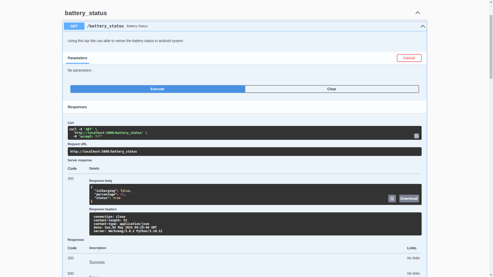

# Android API Testing 
[](https://github.com/gunaNeelamegam/android-prober/actions/workflows/python-publish.yml)
[](https://github.com/gunaNeelamegam/android-prober/actions/workflows/build_apk.yml)

## Library to test the AOSP Hardware APIs

> **Currently Available APIs**

* [X]  Bluetooth   ᛒ
    > ABLE TO DO
    * Connect , Disconnect
    * Pair , UnPair
    * Enable, Disable Service Provider
    * look for more..

* [X]  Sensor (Device Supported Sensor's)
* [X] Text To Speech
* [X] Android Runtime Permission's Based on Android API Version
* [X] Media Control's 
* Record Audio ⏺️
* [ ]  Wifi 👎
* [X]  Battery 🔋
* [X] Make Call (or) Dial Intent 📲
* [X] Brightness 🔆
* [X] Gps ➤
* [X] Android Toast 🔔
* [X] Device Sensor Information 📡
* [X] Vibrator 📳
* [X] Share 🔗
* [X] Email 📧
* [X] Camera 📷

> Android Support 📱
* [X] Android Background Service (Broadcast Receiver)

> NOTE  💡
* Using the Android Background Service API you can able to receive the Android Internal Event Message's
    * Aeroplane mode change's 🛩️
    * Headset adaptor state change's 🎧
    * Incoming Phone Call 📲
    * more...

## Installation

```sh
pip install android-prober
```

## Usage

* Create `main.py` like the contents below.

```python
from kivy.app import App
from kivy.lang import Builder
from android_prober import AndroidProber
from requests import get

KV = '''
BoxLayout:
    orientation: 'vertical'
    BoxLayout:
        size_hint_y: None
        height: '30sp'
        Button:
            text: 'telephony_permission'
            on_press: app.telephony_permission()
        Button:
            text: 'bluetoothPermission'
            on_press: app.bluetooth_permission()
        Button:
            text: 'locationPermission'
            on_press: app.location_permission()

    ScrollView:
        Label:
            id: label
            size_hint_y: None
            height: self.texture_size[1]
            text_size: self.size[0], None
'''

class BluetoothTestViaWebService(App):
    
    BASE_URL = "http://localhost:5000"

    def init(self):
        """ while using webservice to invoke the API's """
        TesterApp.use_flaskapp()

    def on_pause(self):
        return True

    def telephony_permission(self):
        response = get(f"{BASE_URL}/telephony_permission")
        print(response.json)

    def location_permission(self):
        response = get(f"{BASE_URL}/location_permission")
        print(response.json)

    def bluetooth_permission(self):
        response = get(f"{BASE_URL}/bluetooth_permission")
        print(response.json)

    def build(self):
        self.init()
        self.root = Builder.load_string(KV)
        return self.root

if __name__ == '__main__':
    BluetoothTestViaWebService().run()

```


* Create `main.py` without webservice.

```python
from kivy.app import App
from kivy.lang import Builder
from android_prober import AndroidProber
from android_prober import bluetooth

KV = '''
BoxLayout:
    orientation: 'vertical'
    BoxLayout:
        size_hint_y: None
        height: '30sp'
        Button:
            text: 'telephony_permission'
            on_press: app.telephony_permission()
        Button:
            text: 'bluetoothPermission'
            on_press: app.bluetooth_permission()
        Button:
            text: 'locationPermission'
            on_press: app.location_permission()

    ScrollView:
        Label:
            id: label
            size_hint_y: None
            height: self.texture_size[1]
            text_size: self.size[0], None
'''

class BluetoothTest(App):

    def on_pause(self):
        return True

    def bluetooth_permission(self):
       response = bluetooth.bluetooth_permission()
        print(response)

    def build(self):
        self.root = Builder.load_string(KV)
        return self.root

if __name__ == '__main__':
    BluetoothTest().run()

```

##  Build & Run

```sh
pip install -r requirements.txt

buildozer android debug
```
Install the generated apk into the target device.


## Documentation

* python for android webview recipe internally start and serve's web service running on port 5000. 

* You can also test api on Single Click.



* Connect the device using ADB.

* If your using adb via cable, Run this to expose the port `tcp/5000`
```bash
adb forward tcp:5000 tcp:5000
```

## Upcomming updates

-> https://github.com/gunaNeelamegam/android-prober/issues

* Stablity
* API for All Other Interface's
* FastAPI Intergration
